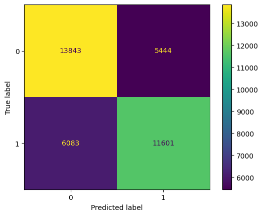
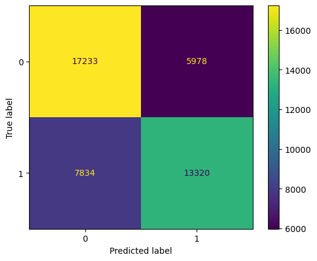
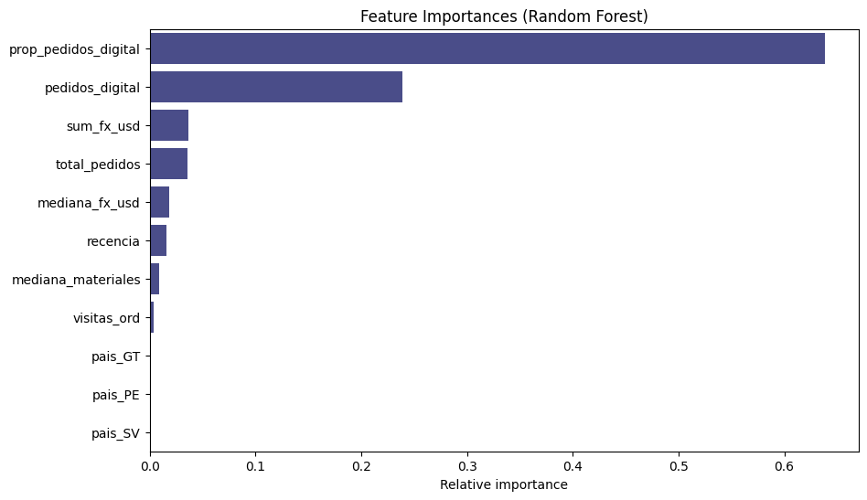

# Predicción de Pedidos Digitales (eB2B)
La compañía busca aumentar el uso de pedidos digitales en la plataforma eB2B. Actualmente, muchos clientes siguen realizando pedidos por teléfono o a través de vendedores. Se desea identificar qué clientes tienen mayor probabilidad de que su próximo pedido sea digital, para enfocar esfuerzos comerciales y de comunicación.

## 1. Resumen de la lógica del análisis
Esta sección resume la lógica detrás de la implementación de los modelos, incluyendo los resultados de las métricas de evaluación.

### 1.1. Notas iniciales
- El dataset posee un tamaño considerable (1.25 millones filas x 14 columnas), por lo que se decidió usar la librería `polars` para su manejo.
-	Para no emplear una cantidad significativa de memoria, se optó por optimizar, transformando variables. Por ejemplo, las variables float64 fueron cambiadas a float32. 66 MB se lograron reducir a 29 MB.
- Se decida trabajar con las siguientes variables:
```["cliente_id", "pais_cd", "fecha_pedido_dt", "canal_pedido_cd", "facturacion_usd_val", "materiales_distintos_val", "frecuencia_visitas_cd"]``` 

### 1.2.	Creación de nuevas variables (Feature Engineering)
Se observó que cada registro representa un pedido; sin embargo solo existen, aproximadamente, 150 mil clientes únicos. Debido a que el objetivo es predecir a nivel cliente, se optó por agregar variables. 
-	Se notó que un cliente pertenece a un solo país, así como a un tipo de visita (`frecuencia_visitas_cd`). Se determina que estas variables pueden ser agregadas por cliente: `pais` y `freq_visitas`, respectivamente
-	Se propone construir una variable que indique la cantidad de pedidos que se hicieron a través del medio digital. Además, es posible calcular la proporción de pedidos hechos digitalmente sobre el total de pedidos: `total_pedidos` (pedidos realizados por cliente); `pedidos_digital` (pedidos hechos de forma digital), `prop_pedidos_digital` (pedidos digital / total pedidos)
-	El EDA reveló que la facturación posee una forma de campana, relativamente. El histograma presenta valores atípicos del lado derecho. Por lo tanto para poder agregar la fx por cliente, minimizando el efecto de los valores "anormales", se opta por usar la mediana y no la media. Variables nuevas: `mediana_fx_usd` y `sum_fx_usd`
-	La distribución de `materiales_distintos` es relativamente uniforme. Esto sugiere que los pedidos se comportan de manera equitativa en cuanto a “cuántos materiales diferentes” compran. Variable nueva: `mediana_materiale`
-	Se estimó valioso crear una variable que indique recencia por cliente: `recencia` (días desde último pedido)
-	**Se contruye una variable respuesta dicotómica considerando si la última compra fue realizada a través de un medio digital `ult_digital`**

### 1.3.	Preparación de los datos 
### 1.3.1. Codificación de variables
- Las variables nominales se codificaron mediante dummy variables. Este método se prefirió a la codificación One-Hot, ya que la codificación dummy omite una de las categorías, evitando así la multicolinealidad.
- Para la variable ordinal `freq_visitas`, primero fue necesario ordenar las clases `(["L", "LM", "LMI", "LMV"])` y, a continuación, se asignó un número a cada una (1, 2, 3, etc.). 

### 1.3.2. Estandarización
La decisión de escalar los datos depende del tipo de modelo utilizado. En este caso, se consideraron dos tipos de modelos: un modelo del tipo lineal (logistic regression) y otro basado en conjunto de árboles, XGBoost; este último no precisa de transformación, funciona bien sin ella. 
Los datos se escalaron utilizando el método z-score.

``` 
def standardization(df, col):
    """
Computes the z-score standardization with mean = 0 and std = 1

Args:
df: dataset
col: features to standardize 
    
Returns
new columns with standardize values
"""
    ave = df[col].mean()
    std = df[col].std()

    df[f'{col}_std'] = df[col].apply(lambda x: (x-ave)/std)
    return df
```

### 1.3.3. Detección de anomalías
La identificación y eliminación de valores atípicos se hizo usando Chebyshevs $(k=3)$.  Para un rango de tres desviaciones estándar alrededor de la media, el teorema de Chebyshev establece que al menos el 89% de las observaciones se encuentran dentro de ese rango. En este caso, el 98.6% de los datos se encuentra dentro de tres desviaciones estándar, lo que indica que no existe un número significativo de anomalías; por lo tanto, se descartaron los valores fuera del rango.

## 1.4. Importancia de variables (Feature Importance)
-   La matriz de correlación indicó las características con alta asociación con la variable objetivo (`ult_digital`); sin embargo, para conocer cuantitativamente cuáles son las variables que tienen mayor influencia, se ajustó un Random Forest. Este algoritmo tiene la ventaja que calcula la varianza aportada por cada variable. 

### 1.5. Modelos implementados
- **Logistic Regression:** adecuado dado que la variable objetivo es binaria. Funciona como línea base rápida e interpretable con probabilidades bien calibradas y efectos lineales/monótonos. 
- **XGBoost:** tiene la ventaja de ser un modelo no paramétrico. No necesita que las variables tengan un comportamiento lineal. Alto poder predictivo, robusto ante datos mezclados y la posibilidad de realizar tuning. 

### 1.6. Métricas del rendimiento de los modelos

| Model               | Accuracy | Precision | Recall | F1-score |
|---------------------|--------- |-----------|--------|----------|
| Logistic Regression | 0.688    | 0.695     | 0.718  | 0.706    |
| XGBoost             | 0.689    | 0.687     | 0.742  | 0.714    |

#### 1.6.1 Confusion matrix
<figure>
  <figcaption>Logistic Regression</figcaption>
  
</figure>

<figure>
  <figcaption>XGBoost</figcaption>
  
</figure>

**Insights**
- Ambos tienen un rendimiento similar (accuracy ≈ 0.69)
- ​​Log Reg presenta mayor precision (0.695), menos falsos positivos, pero menor recall (0.718)
- XGBoost: mayor recall (0.742); encuentra más verdaderos positivos
- F1: XGBoost 0.714 frente a Log Reg 0.706, pequeña ventaja para XGBoost en el equilibrio entre precisión y recuperación


## 2. Hallazgos importantes

### 2.1. Relaciones fuertes / redundancias
  - El número de pedidos está altamente relacionado con el gasto de los clientes `sum_fx_usd` y `total_pedidos` (≈0.92)
  - El coeficiente de correlación entre `pedidos_digital` y `sum_fx_usd` (0.52) es relativamente alto, sugiriendo que a mayor cantidad de pedidos a través de la plataforma digital, más ingreso para la empresa.
  - `pedidos_digital` y `prop_pedidos_digital` (≈0.78) son variables redundantes. No es necesario emplear ambas en el modelado. 
  - Como era de esperarse a mayor facturación y cantidad de pedidos digital, decrece la recencia; es decir, clientes más recientes tienden a estar más activos.
  - Las demás variables como país, cantidad de materiales y visitas del vendedor presentan efectos pequeños (≈0).

### 2.2. Modelos
- Si la omisión de positivos es costosa, es preferible XGBoost (mayor recall/F1).
- Si los falsos positivos son costosos, sería mejor Log Reg.
- En cualquier caso, **ambos modelos se desempeñan satisfactoriamente**. Se podría ajustar el umbral (threshold) de decisión de probabilidades para coincidar con las necesidades y costos del negocio.

### 2.3. Feature Importance 
Los resultados demostraron que tres variables explican aproximadamente el 91% de la varianza total, por lo tanto, se decidió trabajar solamente con `"prop_pedidos_digital", "pedidos_digital", "sum_fx_usd"]`

  Obtenido a través de `RandomForestClassifier`’s `feature_importances_`:

  | Feature                  | Importance (RF) |
  |--------------------------|----------------:|
  | prop_pedidos             |           0.638 |
  | pedidos_digital          |           0.239 |
  | sum_fx_usd               |           0.036 |
  |         ...              |          ...    |
  |         ...              |          ...    |
  |         ...              |          ...    |


  

## 3. Limitaciones y recomendaciones
- **Agregación a nivel cliente**: se pierde dinámica temporal (tendencias/semanalidad)
  - Recomendación: añadir features temporales, por ejmplo: estacionalidad, variabilidad de cliente

- **Redundancia**: `pedidos_digital` vs `prop_pedidos_digital`
  - Recomendación: eliminar una de las variables o aplicar regularización más fuerte.

- **Variables limitadas**: `mediana_materiales` y `visitas_ord` aportan poco
  - Recomendación: incluir otras variables, sobre todo si están a nivel cliente (tipo de cliente, efectividad de visita vendedor)

- **Threshold de 0.50 en ambos modelos**: puede no alinearse con las necesidades/costos del negocio (FN vs FP).  
  - Recomendación: se sugiere experimentar con un corte probabilístico distinto a 50%

- **Modelos**: se podría implementar otro modelo, quizás comparar XGBoost contra LightGBM
